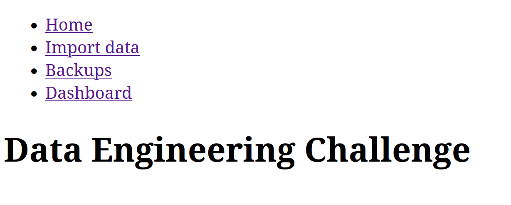
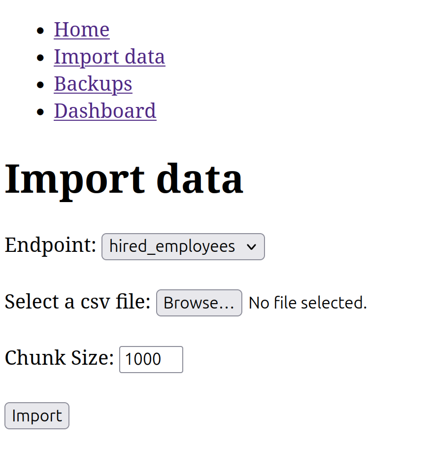
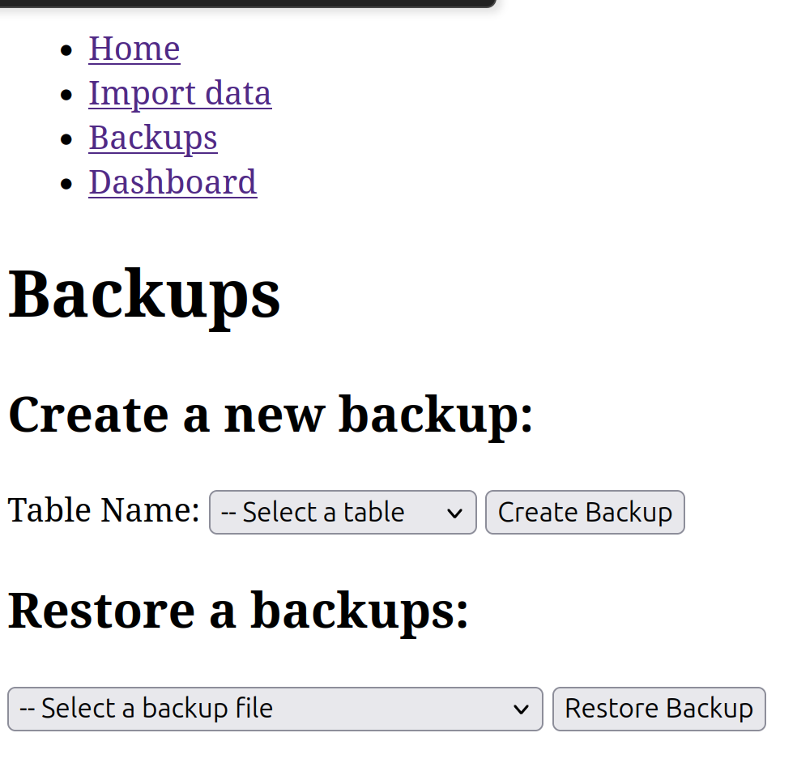
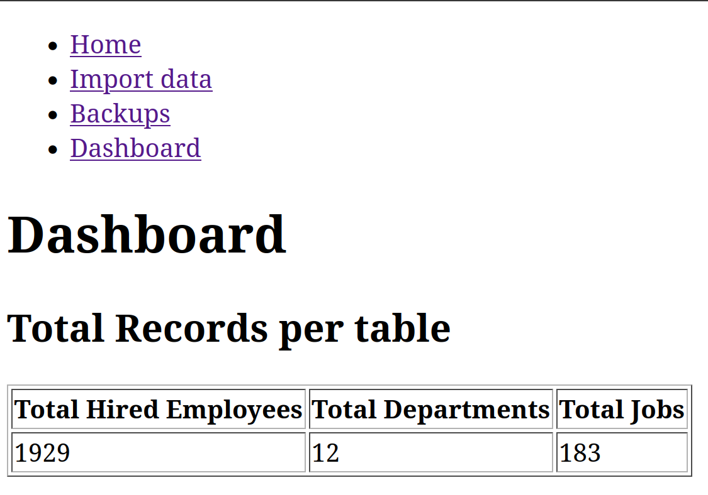
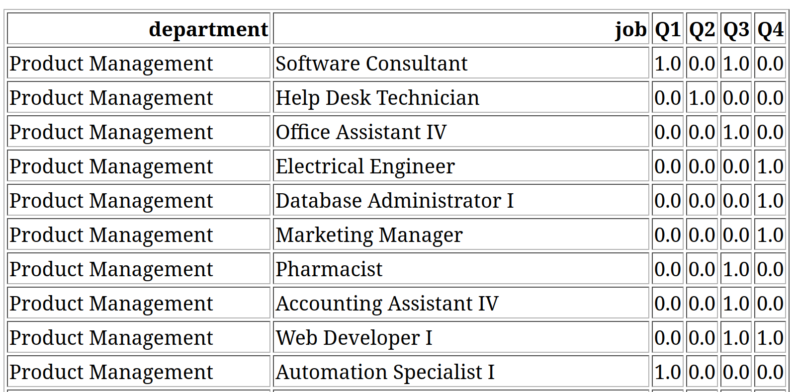
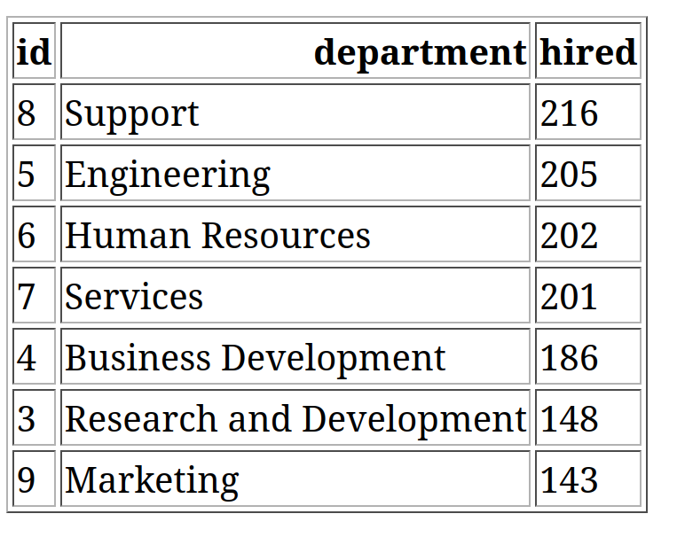
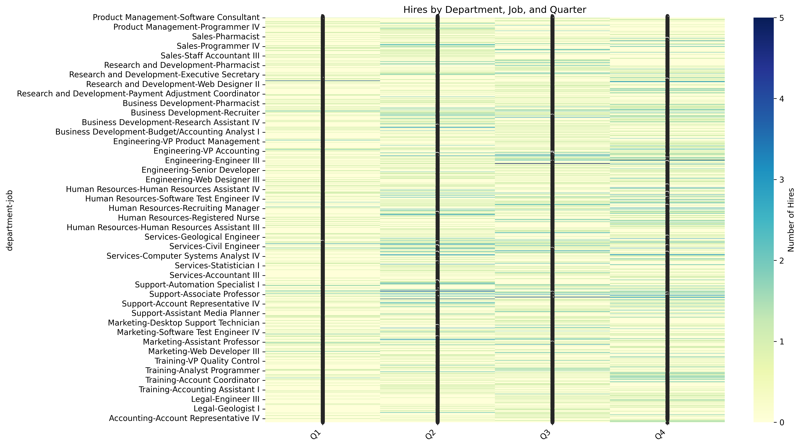
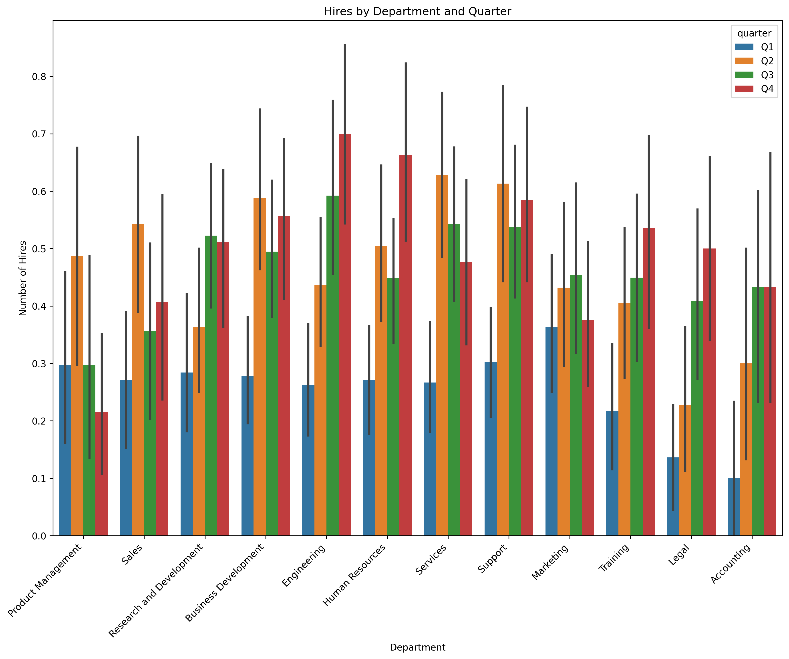
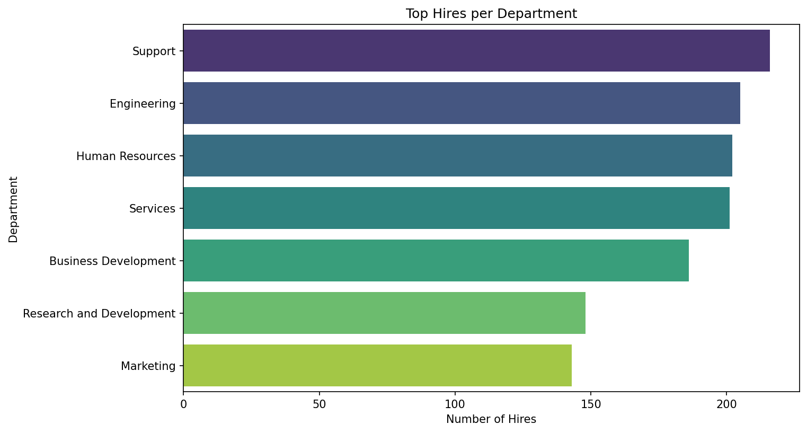

# Data Engineer Challenge

This repository contains the implementation for the data engineer challenge.

## Installation

```
git clone this repo
cd data-engineer-challenge
python3 -m venv venv
source venv/bin/activate
pip install -r requirements.txt
python3 app.py
```

The app.py initializes

```
 * Running on all addresses (0.0.0.0)
 * Running on http://127.0.0.1:8080
 * Running on http://192.168.0.4:8080
Press CTRL+C to quit
 * Restarting with stat
 * Debugger is active!
 * Debugger PIN: 315-947-788
```

## Web Interface

- The API is available at http://127.0.0.1:8080/ (adjust to your ip address)
- All actions in the API are available via web interface






### Import API via CURL

```
curl -X POST -F "file=@data/departments.csv" \
-F "table_name=departments" \
-F "chunk_size=1000" http://YOUR_SERVER_IP:8080/import

curl -X POST -F "file=@data/jobs.csv" \
-F "table_name=jobs" \
-F "chunk_size=1000" http://YOUR_SERVER_IP:8080/import

curl -X POST -F "file=@data/hired_employees.csv" \
-F "table_name=hired_employees" \
-F "chunk_size=1000" http://YOUR_SERVER_IP:8080/import
```

### Create/Restore Backupd via CURL

```
curl -X POST \
-F "restore_file_name=departments___d51850d6-0974-4563-80d9-4f437fecd8b6.avro" \
http://127.0.0.1:8080/backups-restore

curl -X POST \
-F "table_name=departments" \
http://127.0.0.1:8080/backups-create
```

## (Optional) Use Docker to create and and deploy image

```
# Build docker image locally from current dir
docker build -t data-engineer-challenge .

#run local image
docker run -p 8080:8080 data-engineer-challenge
```

## Development plan

\
[X] Set up github repo
\
[X] Load data from csv files in batches
\
[X] test DB connection (try local mysql to start)
\
[X] Create data models, using sqlalchemy
\
[X] Validate data using pandas: missing and incorrect values, date format
\
[X] Verify mysql tables are dynamically created from models
\
[X] Create draft API with Flask
\
[X] Integrate csv to db import function into API routes
\
[X] Implement Backup Create and Restore functionality
\
[X] Add Backup Create and Restore to UI
\
[X] Implement Reports for requirements
\
[X] Isolate db credentials (.env)
\
[X] Implement logging transactions (success/failure) in DB
\
[X] Log transactions in json file in logs folder

## Sample Data Results




## Sample plot images




